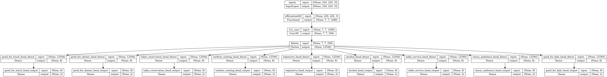

# HydraNet implementation on Yelp image dataset
The goal of this repository is to implement a HydraNet architecture capable of executing the task of multi-class classification. 
A restaurant image can have the following labels associated with it.
1. Is good for lunch?
2. Is good for dinner?
3. Takes reservation
4. Has outdoor seating?
5. Is restaurant expensive?
6. Does the restaurant serve alcohol?
7. Has table service?
8. Is the ambience classy?
9. Is it good for kids?

Our job is to train a multi-class classifier that can predict these tags for any given restaurant image.

### Dependencies:
1. Python >= 3.8
2. TensorFlow >= 2.13
3. OpenCV
4. Tqdm
5. Pandas

### Dataset generation
Before training the model, it is necessary to prepare the dataset first. Please follow the below steps to download and prepare the dataset.
1. The Yelp image dataset can be downloaded from Kaggle. Please click [here](https://www.kaggle.com/competitions/yelp-restaurant-photo-classification/data) to view the dataset page.
2. Once downloaded, make sure to unzip the images in a folder called `train_photos`. Along with the image files, the dataset also contains 2 CSV files, viz. `train.csv` and `train_photo_to_biz_ids.csv`. Make sure to place the two CSV files in the root directory of the repository.
3. Once dataset is downloaded and ready, please run the following script to re-generate the dataset in training compliant format.
`python labels.py`
4. Now the dataset is ready for training.

### Training
1. For training the model, simply run `python main.py`.
2. During training, it will log all the metrics in `log` directory which can be later viewed in TensorBoard.

#### Architecture

Since this is a HydraNet, it is composed of a backbone and multiple heads. EfficientNetB0 is the backbone and a sequence of dense layers compose the heads.

### Pending Work
- [ ] Transformer based backbone
- [ ] Custom backbone
- [ ] Inference pipeline